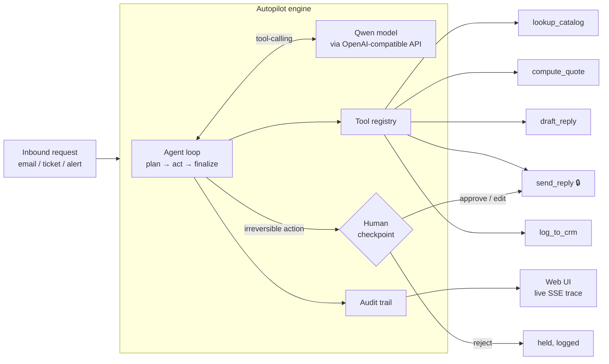

# ⚡ Autopilot Agent

**An AI operations agent that turns inbound business requests — sales inquiries,
support tickets, system alerts — into completed workflows, with a human approval
checkpoint before anything irreversible happens.**

Built on **Qwen** models, running on **Alibaba Cloud**.
Submission for the *Global AI Hackathon with Qwen Cloud* — **Track 4: Autopilot Agent**.

---

## The problem

Operations teams drown in repetitive, multi-step requests: *"can I get a quote for
25 laptops?"*, *"my invoice is wrong"*, *"disk is 90% full on prod-3."* Each one means
reading the request, looking things up across tools, making a decision, and acting —
and most are near-identical. Naïve "AI automation" either can't be trusted to act, or
acts recklessly with no oversight.

**Autopilot** does the whole workflow autonomously **but stops at a human checkpoint
before any irreversible, customer-facing, or money-moving action.** You get the speed
of automation with the safety of a human in the loop — and a full audit trail of every
decision.

## What it does (the bundled demo: sales inquiry → quote)

Given a free-text inquiry email, the agent:

1. **Reads the ambiguous request** and figures out intent.
2. **`lookup_catalog`** — finds the right SKUs.
3. **`compute_quote`** — prices them with tier + volume discounts, checks stock.
4. **`draft_reply`** — writes the customer email.
5. **🔔 Human checkpoint** — you Approve / edit / Reject the email before it's sent.
6. **`send_reply`** (only if approved) and **`log_to_crm`**.
7. Returns a summary; every step is in the audit trail.

### Two workflows, one engine

To prove it generalizes, the repo ships **two** workflows on the identical agent loop —
switch between them in the UI (or `SCENARIO=sales|incident`):

- **Sales inquiry → quote** (above): checkpoint before emailing the customer.
- **Incident alert → remediation**: an inbound monitoring alert is triaged — pull metrics,
  consult the runbook, then propose a **service restart** that's gated behind the human
  checkpoint; on rejection it escalates to on-call instead of acting.

The agent only ever sees tool *schemas*, not implementations — so a new domain is just a
new tool set. That's the whole idea: trust-calibrated autonomy that ports anywhere.

## Quickstart (runs offline, no API key)

```bash
# Node 22.6+  (or Bun)
npm run demo          # end-to-end trace in your terminal, mock provider
APPROVE=reject npm run demo   # watch the checkpoint block the send
npm test              # 5 passing tests
npm run serve         # web UI with live trace + Approve/Reject  → http://localhost:8787
```

The **mock provider** stands in for the model so you can see the full orchestration,
tool wiring, approval gate, and audit trail with zero cost. To run on the real model,
set the Qwen env vars below.

## Run on Qwen Cloud

```bash
cp .env.example .env
# in .env:
LLM_PROVIDER=qwen
QWEN_API_KEY=...        # free hackathon credits: https://www.qwencloud.com/challenge/hackathon/voucher-application
QWEN_BASE_URL=https://dashscope-intl.aliyuncs.com/compatible-mode/v1
QWEN_MODEL=qwen-plus
npm run serve
```

The Qwen provider ([src/llm/qwen.ts](src/llm/qwen.ts)) talks to Qwen Cloud's
OpenAI-compatible chat-completions endpoint with native tool-calling — no SDK, just
`fetch`, so the whole project has **zero runtime dependencies** and deploys anywhere.
For production deployment on Alibaba Cloud (required for judging), see **[DEPLOY.md](DEPLOY.md)**.

## Architecture



**Design principles**

- **Provider-agnostic core.** The agent is written against an `LLMProvider` interface
  ([src/llm/provider.ts](src/llm/provider.ts)); Qwen, the offline mock, or any other
  tool-calling model plug in without touching agent logic.
- **Tools are data + a function.** Each tool carries a JSON-Schema and a `run()`; a tool
  flagged `requiresApproval` is automatically routed through the human checkpoint.
- **Everything is audited.** Every model turn, tool call, approval decision, and error is
  an immutable `AuditEntry` — that's what the UI streams and what makes it auditable.

## Project structure

```
src/
  llm/provider.ts   LLM interface + message/tool types
  llm/qwen.ts       Qwen Cloud provider (OpenAI-compatible, fetch-only)
  llm/mock.ts       Deterministic offline provider for demo/tests
  agent/agent.ts    The agent loop: plan → tools → human checkpoint → finalize
  tools/registry.ts Tool registry + approval routing
  tools/businessTools.ts  Catalog / pricing / CRM / draft / send tools
  scenarios/index.ts         Scenario registry (sales, incident) — one engine, many tool sets
  scenarios/salesInquiry.ts  Sales-inquiry workflow + offline reasoning plan
  scenarios/incidentResponse.ts  Incident-remediation workflow (proves generalization)
  audit.ts          Append-only structured audit trail
  server.ts         Dependency-free HTTP server + SSE + approval API
  demo.ts           Terminal end-to-end demo
public/index.html   Web UI: live trace + interactive Approve/Reject
test/run.ts         Unit tests   ·   test/integration.ts  HTTP/SSE test
```

## Tests

```
npm test     # 8 passing (sales + incident workflows)
  ✅ happy path completes the workflow and sends one email
  ✅ quote math: business-tier 6% volume discount on 3×25 = $42,300
  ✅ human-in-the-loop: rejecting approval blocks the customer email
  ✅ audit trail records an approval checkpoint and the tool calls
  ✅ only customer-facing send_reply is gated for approval
  ✅ incident workflow triages and restarts on approval (same engine, new tools)
  ✅ incident workflow: rejecting approval blocks the disruptive restart
  ✅ incident workflow gates only the disruptive tools
```

## License

MIT — see [LICENSE](LICENSE).
